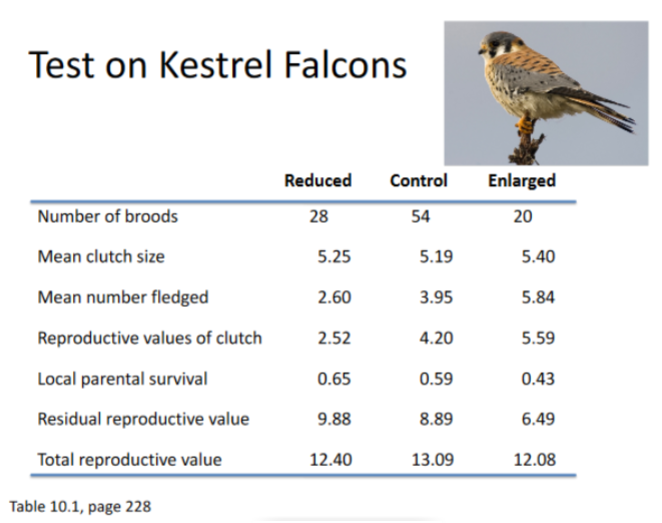
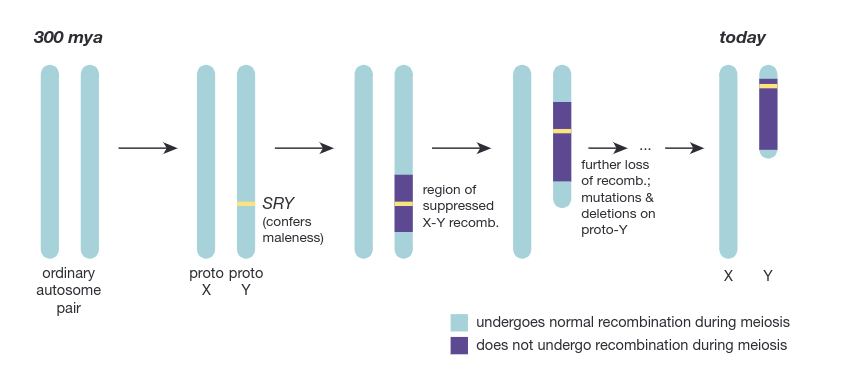
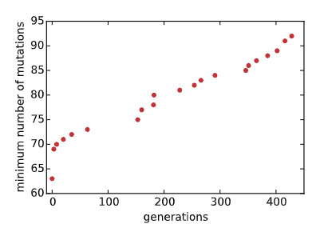

# Evolutionary Biology Problem Set 3

## Problem 1

Sometimes we would like to learn about the recent evolutionary history of a population, for example, that of humans. Coalescent theory provides a powerful toolkit for finding signatures of recent evolutionary events (e.g., population expansion or contraction; natural selection) in the standing genetic variation of a present-day population. We explore the intuition of some of this below. We will use the term nucleotide variant to refer to a nucleotide at a position in a sequence/chromosome that differs from the nucleotide found at the same position in other sequences. Variants are said to be at high or low frequency in a population depending on whether a large or small proportion of the sequences in that population have the variant nucleotide. A variant is called a “singleton” when it is only found in only one sampled sequence (e.g., the G in position 2 of sequence 1 in part (c) of this problem).

1. You have obtained the sequences of some predetermined region of the genome from a number of randomly selected individuals. Imagine that the genomic region in question is under strong purifying selection (i.e., mutations in this region confer greatly reduced fitness to the organisms that carry them). Will the variants in these sequences tend to be found at high frequency or at low frequency/as singletons (i.e., found only in one individual/on one chromosome)? (Hint: think about how selection affects the probability of fixation of a new allele and its time to extinction.)

> . . .

2. Recall that Π is the average number of nucleotide differences between a pair of randomly selected sequences

Seq 1: A A A A

Seq 2: A T A A

Seq 3: A T A C

For example, for the (3 choose 2) = 3 unique pairs of the three sequences above, &prod; = (1 + 2 + 1) / 3 = 1.33. Will &prod; be larger for a set of sequences with mostly singleton variants or a set with mostly high frequency variants? (Hint: think about variation at a single site. Will &prod; be higher is there is one A and many G's or if there are an equal number of A's and G's?)

> . . . 

2. Below are the sequences of a 20-nucleotide stretch of five randomly selected chromosomes from a popu- lation. An asterisk ‘*’ indicates that the sequence has the same base as the reference in that position. How many segregating sites, S, are there in this sample? (S is more properly denoted S5 here, as there are 5 sequences in the sample.) Recall that S is defined as the number of sites at which one or more sequences has a variant nucleotide

Ref0: A A T G A C T A G C T T A G A C A G G G

Seq1: * G * * * * * * * * * * * * * * T * * *

Seq2: * * * A * * * * * * * * * * * * * * * *

Seq3: * * * C * * * * * * * * * * * * * * * *

Seq4: * * * * * * A * * * * * * * * * * * A *

Seq5: * * * * * * A * * * * * G * * * * * * *

> . . . 

4. Calculate the average nucleotide diversity, &prod; D , of this sample. Note that we are not asking you to calculate &prod; hat D , the expectation of this average as presented in lecture, but rather just &prod; D , the standard arithmetic average

## Problem 2

1. In the kestrel study mentioned in class and in the textbook (Table 10.1, page 228), what are the relative fitnesses of the control birds and the birds with manipulated clutches? For your convenience, the relevant table is presented here.

    
> . . . 

2. Assume that the population consists only of individuals producing one egg less than the optimum and that there is a single gene affecting clutch size with its normal allele designated A1. A mutant allele, A2, arises at this locus, such that the heterozygous A1A2 females have a clutch size size increased by one egg and the homozygous A2A2 females have a clutch size increased by two eggs. Would you expect this locus to be under directional selection, balancing selection, or disruptive selection?

> . . . 

3. Assume the initial value of the A2 allele is 0.01. Using the selective advantage calculated in part (a) and the population genetic model for selection at a single locus in a large population, calculate the frequency of A2 in the next generation.

> . . . 

4. One feature of kestrel biology which violates the assumptions of our standard population genetic model is that kestrel generations overlap. Considering this, will the actual change in allele frequency be greater or smaller than your approximation? Explain briefly.

> . . . 

5. If the results of the kestrel study had been different, and the enlarged clutches actually imparted a higher total reproductive value than did the control clutches, how would you rationalize the apparently “sub- optimal” clutch size of these birds? (Assume further that clutch size is at equilibrium; it is not still evolving towards an as yet unattained optimum.)

> . . .

## Problem 3

1. Explain how sexual selection can be advantageous for the evolution of a population

> Sexual Selection allows for traits recogizable by choosing partners as indexing or mapping to some heritable genotype. The role of the agent in being attracted or seduced factors into complexity of selection and the richness of forms produced thereof.

2. Sexual selection can result in large disparities in reproductive success among members of the competing sex. How might this be disadvantageous for the evolution of a population?

> Competition here burns up resources so to speak. If there is some subset of sexual allurement which maps to nothing of actual efficacy, then all competition derived thereof is sort of like Brownian motion. Instead of integrating towards a particular direction, the forms of life spin around, averaging no real movement at all. This can likely create situations wherein investment of not only resources but all attention is wasted as a sort of excess.

3. Is sexual selection stronger or weaker in monogamous species? When might monogamy be a successful mating strategy? Explain briefly.

> Sexual selection is weaker in monogamous species. This reduces the difference proliferative under the process of sexual selection often leading to very little of a 'gender' divide in not only apperance but also behavior. Overall we see a reduction in constitutive agitation (known as competition).

## Problem 4

The t haplotype polymorphism in mice involves a Mendelian transmission distortion favoring t-bearing chromosomes in heterozygous +/t individuals. Consider a theoretical case in which segregation distortion occurs in both males and females, and in which both homozygous tt males and females die before reproductive age (but the survivorship of heterozygous +/t individuals is unaffected). Suppose that of the gametes produced by +/t heterozygotes, a fraction k has the genotype t and a fraction 1−k has the genotype +, where k ≥ 0.5. Assume a population genetic model for selection at a single locus.

1. Write down an expression for the allele frequency, q′. (Hint: It’s useful to think of q′ as the as the fraction of all gametes released by members of the current generation that are t-bearing gametes.)

> . . . 

2. Plot the change in allele frequency when k = 0.68. (note that by change we mean for you to compute the difference rather than the ratio) Make sure to include any computer code you wrote to generate this plot

> . . .

3. Write down an expression for the allele frequency that leads to equilibrium in terms of k. Explain how you got your answer. (Hint: you can use part (a) to spot check your answer)

4. Why does this equation make intuitive sense? Specifically, why does the t allele go extinct when k = 0.5? Why does it reach an equilibrium frequency between zero and one when 1/2 < k < 1?

> . . . 

## Problem 5

During cell division, microtubules of the spindle apparatus attach to chromosomes at their centromeres. In most eukaryotes, centromeric DNA consists of large arrays of repeated sequences. Cen- tromeric histone-like proteins package centromeric DNA into specialized nucleosomes that can be linked to the spindle apparatus. This creates an opportunity for competition between allelic centromeres, as those that can contact and be packaged more efficiently by centromeric histone-like proteins can increase their chances of transmission during meiosis.

1. Explain how centromere drive, the biased transmission of one centromeric allele over others, could be disadvantageous to a species in which it is operating.

> . . .

2. Why is it the case that centromere drive is generally seen in the context of female, rather than male, meiosis. (Hint: what happens during the process of oogenesis?)

> . . .

3. Explain how centromeric histone-like proteins could play a role in ameliorating the conflict between the chromosome and the whole organism created by centromere drive?

> . . .

4. The sequences of the centromeric DNA repeats are subject to very rapid evolution. Is this rapid evolution an example of the Red Queen effect? Explain your answer.

> . . .

5. Centromere evolution has been proposed as a possible mechanism for speciation. Explain how centromere evolution might lead to the reproductive isolation of two subpopulations of a species that have been physically isolated for some time.

> . . . 

# Programming Exercises

## Problem 6

1. Write a computer program for the Wright-Fisher model of drift, assuming a haploid, asexually reproducing population with two selectively neutral alleles, A and a, at one locus. Your simulator should have at least two input parameters: (1) N, for population size; and (2) i0, for the initial number of A alleles in the population (or p0 for the initial allele frequency of A, as long as you convert p0*N to an integer number of initial alleles). It might be helpful to have a third parameter, n gen, for the number of generations to simulate. Alternatively, you could have your simulator terminate once the allele either fixes or is lost. Plot a few example runs to check that your program runs correctly. Your “solution” to this part of the problem is to include your program code in an attachment to your problem set submission so that it can be checked.

> . . .

2. Plot a few runs of your simulator with generations on the x-axis and p on the y-axis (make sure your axes are labeled!) for three values of N : N = 10, N = 100, and N = 1000. If possible, plot all runs from one value of N together on one plot. Describe qualitatively the effects of drift as the population size N increases from, say, 10 to 100 to 1000. Submit your plots in support of your explanation.

> . . .

3. Using your program, estimate the probability that an allele having frequency i/N will be fixed in the population. Explain how you arrived at this estimate

> . . .

4. Using your program, estimate the average time (in number of generations) needed for a newly arisen (X0 = 1), neutral allele to go to fixation as a function of N . Explain how you arrived at this estimate.

> . . .

## Problem 7

300 million years ago in the common ancestor of therian mammals, today’s X and Y chro- mosomes were an ordinary pair of autosomes. After the proto-Y acquired a sex-determining mutation, it ceased to undergo normal recombination with the proto-X along most of its length (Fig. 1). In effect, this cessation of recombination made the Y subject to asexual haploid evolution, and the results were distastrous. Millions of years of degenerative evolution ensued—inactivating mutations were acquired and fixed, genes were lost—leaving today’s Y with only 3% of the genes it once shared with the X. Muller’s ratchet has been proposed as a key mechanism underlying the mammalian Y’s degeneration. In this problem, you will use simulations of Muller’s ratchet to gain insight into the Y’s history and future

Figure 2: A simplified depiction of the evolution and degeneration of the mammalian Y chromosome from its once identical partner, the X. Only 3% of the genes present on the ancestral autosomes remain within the Y’s “male-specific” region (purple), which does not normally undergo recombination with the X.

1. Briefly explain how the absence of recombination (leading to the operation of Muller’s ratchet) could drive gene loss on the Y chromosome.

> . . .

2. If Muller’s ratchet is responsible for the Y’s degeneration, we would like to know how quickly it operates. At any given time, the chromosomes in a population carry different numbers of mutations. When the chromosome with the fewest mutations is lost from a population due to the sampling effect of drift, the minimum number of mutations that any chromosome carries increases. This is referred to as one “turn” of the ratchet. Write a program to simulate this process. Your program should take take four parameters: N, the number of Y chromosomes in the population; u, the per-chromosome mutation rate per generation; s, the average selection coefficient for new mutations; and n turns, the number of “turns” of the ratchet to observe before ending the simulation. An example plot showing the results of one simulation can be found on the next page (Fig. 2). A recommended procedure for implementing the simulator is as follows:
> . . .

Figure 3: An example run of a Muller’s rachet simulation. Each point represents one turn of the ratchet, showing both the mutational burden of the fittest chromosome at the time of turn as well as the number of generations elapsed (since the start of the simulation). As time goes on, the miminimum number of mutations that any chromosome carries increases.

1. Initialize a length-(n turns+1) array, gens, for storing the generations on which you observe turns of the ratchet. Set gens[0] to 0. For example, if the first turn of the ratchet occurred after 100 generations and the second turn happened 50 generations later, you would set gens[1]=100 and gens[2]=150

> . . .

2. Initialize a length-(n turns+1) array, minmuts, for storing the minimum number of mutations car- ried by any chromosome. minmuts[t] will hold the minimum number of mutations carried by any chromosome after t turns of the ratchet.

> . . .

3. Initialize a length-N array, pop, for representing your population. pop[i] will contain the number of mutations present on the i-th chromosome in the current generation. Rather than starting with zero mutations on all chromosomes, fill your first generation according to the expectations of mutation- drift balance. To do this, draw N random numbers from a Poisson distribution with mean u/s. (Hint: use numpy.random.poisson or scipy.stats.poisson.rvs in Python or poissrnd in MATLAB.) Set minmuts[0] to the minimum number of mutations carried by any chromosome in this initial generation.

> . . .

4. From this initial generation of fathers’ Y chromosomes, create a a new generation of their sons’ Y chromosomes as follows

* Choose a random chromosome from the population (i.e., a father’s Y) for replication

* Subject the replicated chromosome (i.e., the son’s Y) to possible mutation. Draw a random number from a Poisson distribution with mean u (not u/s), representing the number of new mutations acquired by the son’s chromosome. Add this number of new mutations to the number its father possessed. (Note: the number of mutations that the father’s chromosome possesses should not change.) 5 

* Determine whether this son’s chromosome survives to the next generation by overcoming selec- tion. Draw a uniform random number between 0 and 1. (Hint: random.random in Python or rand in MATLAB.) If this number is less than (1 − s)k, where k is the number of mutations on the chromosome, add this chromosome to your new generation

* Continue randomly replicating, mutating, and subjecting chromosomes to selection until you have successfully filled the next generation with N new chromosomes

> . . .

5. Find the minimum number of mutations that any chromosome carries. If this number is higher than the previous minimum, the ratchet has just completed one turn. Record this generation in gens and the minimum number of mutations present in minmuts.

> . . .

6. Repeat this process until the ratchet has turned n turns=20 times

> . . .

7. Plot the results of your simulation with generations on the x-axis and the minimum numbers of mutations in those generations on the y-axis. See the lecture slides for an example. A scatter plot would work well for this (scatter in Python’s pylab/matplotlib.pyplot or in MATLAB) 

> . . .

Submit your code as your solution to this part of the problem. You should still try to answer the questions below even if you are unable to produce fully functional code

3. Run and plot a few simulations using different values of N (e.g., N=100, N=1000) using u=0.1 and s=0.01. (We justify the use of u=0.1 by assuming that the per-site mutation rate on the Y, which is slightly higher than on autosomes, is 10−7 and that there are approximately 106 functionally important sites.) How does the size of the population affect the rate at which the fittest chromosomes are lost from the population?

4. For a fixed value of N and u=0.1 as above, run and plot a few simulations using different values of s (e.g., s=0.05, 0.01, 0.001). How does selection against new mutations affect the rate at which the fittest chromosomes are lost from the population?

> . . .

5. The effective population sizes of humans and other large mammals are generally considered to be in the tens of thousands. For flies, effective population size can be well into the millions. Would Muller’s ratchet be an equally plausible mechanism for Y chromosome degeneration in flies? Explain briefly.

> . . .

6. Things aren’t looking good for the Y chromosome. It seems as though Muller’s ratchet has it on a steady path toward oblivion. We have assumed for our simulation that the average selection coefficient for a new mutation remains constant over time. Suppose that as the result of Muller’s ratchet genes on the Y with the least important functions are slowly whittled away leaving an increasingly small set of genes with, on average, increasingly more important functions. (Indeed, we think this is what has happened.) In this scenario, we might expect the average selection coefficient for new mutations to increase over time. What effect would this have on the rate of Muller’s ratchet and the degeneration of the Y chromosome? Do you think the Y will ultimately go extinct?

> . . .
