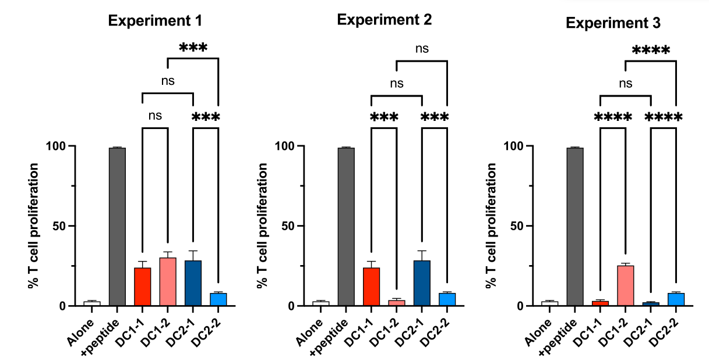

# 7.23 Practice Exam 2023

## Problem 1

Dysregulated immune functions can often inadvertently cause tissue damage instead of protecting against injury. As an example, immune-mediated inflammation can often worsen outcomes in mouse models of ischemic injury (reduced blood flow, such as via stroke models or loss and regaining of circulation in liver models). The mechanisms of initiation of inflammation in ischemic injury are of great interest, as understanding them may lead to new treatments.

1. Would the innate immune reconition in these types of injury more likely to arise from PAMP or DAMP recognition? In no more than a couple of sentences, justify your answer.

> DAMP recognition - given we are talking about ischemic injuries like stroke, these tend to be sterile (no pathogen involved). Therefore, it is more likely to be a matter of tissue damage rather than a pathogen-derived pattern.

2. An experiment was conducted in a lung ischemia model that found that tissue damage was reduced in MyD88 KO mice. What is the class of pattern recognition receptors that are implicated as important by this observation?

> TLRs

3. Briefly describe an experiment that you could conduct to indentify the exact pattern recognition receptor that is worsening tissue damage in this model. For the sake of this question, assume you have access to every transgenic and knockout mouse ever created. You may also assume only one PRR is involved.

> Conduct the ischemia model experiments in various TLR knockout mice. Using the WT mice as a control (to understand what no effect would look like), and the MyD88 mice as a control (to show a benchmark for improvement), compare the TLK KO mice for effects.

4. Based on the information in this question, list one possible immune effector function downstream of PRR engagement that may be causing the worsening in tissue injury outcomes. In one sentence, justify your answer.

> Many answers possible - but recruitment of innate cells, production of inflammatory protein factors, etc can be responses

## Problem 2
Chimeric antigen receptors (CARs) T cells are engineered cellular immunotherapies. For CAR-T cells, a patient’s T cells are engineered to express a synthetic immune receptor in which an antibody fragment (typically an scFv) is fused to T cell signaling domains from proteins such as CD3, CD28 and 4-1BB. So far, six therapies have been approved by the FDA for targeting the surface protein CD19 in B cell cancer, and the surface protein BCMA in multiple myeloma.
 
Despite the excitement surrounding CAR-T cells, they have yet to be successfully applied to other tumor types, including solid tumors such as melanoma. One of the reasons is that it is difficult to identify targets for CAR-T cells that can differentiate tumor from healthy tissue.

1. Many companies are working to create T cell therapies with engineered TCRs(TCR-T) rather than CAR-T. One of the proposed benefits is the potential to target a more diverse array of antigens, even from intracellular proteins. Explain how a TCRs can target a wider array of antigens than a CAR. Name at least one key protein that enables this recognition

> TCRs are able to recognize intracellular proteins via processing and antigen presentation on MHC molecules. This allows for a wider range of proteins to be targeted. Proteins that enable this can range from MHC molecules (class I, B2M), to key factors for the antigen presentation pathways.

> Note: partial credit was given for answers mentioning the polyclonal nature of TCRs as compared to CARs leading to targeting of multiple antigens. This is correct to some extent (VDJ recombination leads to diverse TCRs that can recognize a wide array of antigens), but keep in mind that (a) this is also true for CARs, whose binders are largely derived from antibodies, and (b) any product is likely to have only one TCR…

2. One limitation of TCR-T therapies is that any given TCR will likely only be used in a subset of the patient population for any given cancer (likely no higher than 30-40%), even if the TCR-targeted protein is found in every patient’s tumor. This is the case even if the protein is unmutated (such as for cancer testis antigens like MageA3). Briefly explain why.

> MHCs are highly polymorphic – thus, a TCR that can target a peptide presented by even a highly abundant MHC (such as HLA-A2) can only work on the population that expresses that MHC. 

## Problem 3

Mutations in the complement pathway and associated proteins can cause either immunodeficiencies or autoimmune-like symptoms, depending on the exact mutation. While rare, loss of function mutations in CD59 (also known as protectin) cause a severe phenotype including hemolytic episodes (the lysis of red blood cells), as well as neurological symptoms.

A 2014 case study in the New England Journal of Medicine showed that administering eculizumab, a monoclonal antibody that inhibits cleavage of C5, was successful in reducing harmful symptoms. While CD59 deficiency is rare enough that running a clinical trial may be difficult, this case study demonstrated a possible treatment.

1. Based on the information provided above, describe which of the major effector functions of the complement cascade is dysfunctional in patients with CD59 deficiency, and why C5 inhibition can serve as an effective treatment.

> CD59 works to inhibit formulation of the MAC, so it is the membrane attack/lysis arm of the complement pathway that is causing the pathology. C5 inhibition can work because it is what initiates MAC formation.

2. You are consulting for a company that wishes to use pegcetacoplan (a peptide-based C3 inhibitor approved by the FDA in 2021) for treating CD59 deficiencies. Based on your proposed mechanism of action of eculizumab, would you pegcetacoplan to also work? Briefly justify your answer.

> Yes – C3 is upstream of C5, so C3 inhibition should also prevent formation of the MAC. 
 
3. Both pegcetacoplan and eculizumab can cause adverse effects in terms of susceptibility to infection. Which drug would you propose causes greater susceptibility to infection? Briefly justify your answer.

> Pegcetacoplan would be more likely to have worse effects, because C3 is necessary for other complement effector mechanisms beyond the MAC – so C3 inhibition would affect a wider array of potential anti-microbial immunity.

4. Another drug that affects C5, vilobelimab, has been under investigation as a possible treatment for the sepsis-like symptoms (including accumulation of neutrophils and monocytes) that are associated with severe COVID-19. Propose the most likely mechanism of complement activity that this drug is aiming to block.

> Given the accumulation of innate immune cells, C5 inhibition seemingly works via inhibiting formulation of C5a, which serves as a chemotactic agent and activator of innate immune cells.

## Problem 4 

You want to study conventional dendritic cells and how both subsets conduct antigen presentation to CD8+ T cells. To do so you use introduce antigen to DCs in two ways: a viral model in the virus encodes the OVA antigen, and a cell line expressing OVA. DC from both systems will be isolated and used to stimulate CD8 T cells. The readout is T cell activation shown as % proliferation, meaning the more the cells are activated, the more they proliferate. You measure both DC1 (red bars) and DC2 (blue bars), but lost the labels for the experiment so don’t know if condition 1 (DC1-1, DC2-1) or condition 2 (DC1-2, DC2-2) is the viral model or the cell line model.

In Experiment 1 you assess DC from wildtype mice, while in experiments 2 and 3 you use mice deficient in antigen presentation. Unfortunately, the labels of the knockout mouse strains were also gone (you learn to use ethanol-proof markers from now on!).

1. From the data shown in Experiment 1 please deduce what conditions 1 (shown as -1) and 2 (shown as -2) are. Remember you used a viral infection and a cell line expressing OVA. Please justify your answer in 1 sentence.  

> Virus can infect DC -> will be presented as endogenous antigen on MHCI on both DC1 AND DC2 (condition 1)

> Cell associated Ag needs to be cross-presented and thus only DC1 can effectively cross-present and stimulate T cells (conditions 2)

2. Please suggest what gene/protein is knocked out in the mouse strain used in experiment 2. Please justify your answer in 1 sentence.

> Deficiency in the presentation of exogenous antigens/ cross-presentation while endogenous presentation is intact.

> Potential candidates Clec9a, TIM3, TIM4 c-type lectin, I would account phagocytosis deficiency as an OK answer as well

> Wrong answers anything involved in endogenous MHCI presentation

3. Please suggest what gene/protein is knocked out in the mouse strain used in experiment 3. Please justify your answer in 1 sentence.

> Deficiency in the presentation of endogenous antigens but cross-presentation is intact. Potential candidates TAP1/2, any proteasome component, ERAP, ERp57, tapasin Wrong answers anything involved with MHCI folding, chaperons, b2m, etc.

4. How would treatment with IFN-I affect the antigen-presentation of DC1 shown in experiment 2 and 3.

> IFN-I affects MHCI expression and presentation; All conditions with T cell stimulation will have enhanced stimulation; those deficient for genes in the MHCI presentation pathway will not have increased antigen presentation

5. Next you want to develop a mouse model lacking all conventional DC. Please list all precursors of DC and indicate which one you would like to genetically ablate to blunt only cDC development.

> HSC &rarr; CMP &rarr; preDC &rarr; cDC1 and cDC2
> HSC &rarr; CMP &rarr; monocytes &rarr; moDC
> HSC &rarr; CLP &rarr; pDC
> Target preDC
