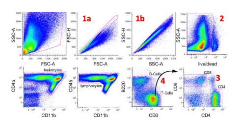

# 7.23 Problem Set 1 Solutions

## Problem 1a-e

1. Differences between the following

1. Innate Immunity vs Adaptive Immunity

> Innate Immunity largely works via evolutionary conserved recognition to PAMPs/DAMPs, fast-acting, does not show antigen specificity, can be plastic in its response, no memory. Adaptive Immunity shows specificity for target, slow to ramp up(~1 week), also palstic, exhibits memory.

2. Progeniors vs. stem cells

> Stem cell - a type of cell that can differentiate into other cell types, and also can self-renew to create more of itself. Progenitor - a cell that can differentiate into other cells, but does not have self-renewal capabilities

3. Myeloid vs Lymphoid

> Myeloid cells - related to the bone marrow, represents the majority (but not entiret of inntate immune cells). Lymphoid - related to the lymphatic system, comprises the adaptive immune cells (B cells, T cells) as well as certain innate immune cells (NK cells/ILCs, pDCs)

4. Neutrophil vs Macrophage

Neutrophil: myeloid cells that are some of the most immediate immune effectors. Short-lived, migrate to tissues from the blood, can phagocytose, and cause other inflammatory functions. Macrophage: myeloid cells that are phagocytic. Most differentiate from monocytes, although some tissue-resident macrophages develop

5. Primary vs Secondary lymphoid tisue

> Primary: where immune cells initally develop (bone marrow/thymus); Secondary: where immune cells first react with antigen(lymph nodes) 

## 2a-e

2. Flow cytometry is a foundational technique for immunology! It’s helpful to get some practice interpreting plots from papers. In modern papers, highly multiplexed antibody panels are often used to characterize many cell types and phenotypic states at once. Authors are commonly asked to include an overall scheme of their flow cytometry experiment to aid the reader in understanding the work, and to serve as a check that the experiment was conducted correctly. The following is from a paper (Kirchbaum et al, PNAS 2016) that we will use as an example to ask a few questions. 

In the FACS experiment below, you can presume that each plot represents a subset of the cells to the right of it, as indicated by either the pink “gate” or the arrow (with the CD45/CD11b plot following the SSC-A/live-dead plot)

