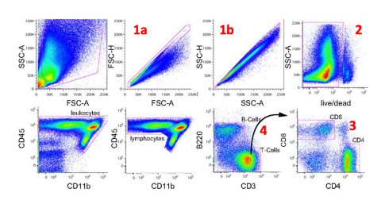

# 7.23 Problem Set 1 Solutions

## Problem 1a-e

Differences between the following

1. Innate Immunity vs Adaptive Immunity

> Innate Immunity largely works via evolutionary conserved recognition to PAMPs/DAMPs, fast-acting, does not show antigen specificity, can be plastic in its response, no memory. Adaptive Immunity shows specificity for target, slow to ramp up(~1 week), also palstic, exhibits memory.

2. Progeniors vs. stem cells

> Stem cell - a type of cell that can differentiate into other cell types, and also can self-renew to create more of itself. Progenitor - a cell that can differentiate into other cells, but does not have self-renewal capabilities

3. Myeloid vs Lymphoid

> Myeloid cells - related to the bone marrow, represents the majority (but not entiret of inntate immune cells). Lymphoid - related to the lymphatic system, comprises the adaptive immune cells (B cells, T cells) as well as certain innate immune cells (NK cells/ILCs, pDCs)

4. Neutrophil vs Macrophage

Neutrophil: myeloid cells that are some of the most immediate immune effectors. Short-lived, migrate to tissues from the blood, can phagocytose, and cause other inflammatory functions. Macrophage: myeloid cells that are phagocytic. Most differentiate from monocytes, although some tissue-resident macrophages develop

5. Primary vs Secondary lymphoid tisue

> Primary: where immune cells initally develop (bone marrow/thymus); Secondary: where immune cells first react with antigen(lymph nodes) 

## 2a-e

2. Flow cytometry is a foundational technique for immunology! It’s helpful to get some practice interpreting plots from papers. In modern papers, highly multiplexed antibody panels are often used to characterize many cell types and phenotypic states at once. Authors are commonly asked to include an overall scheme of their flow cytometry experiment to aid the reader in understanding the work, and to serve as a check that the experiment was conducted correctly. The following is from a paper (Kirchbaum et al, PNAS 2016) that we will use as an example to ask a few questions. 

In the FACS experiment below, you can presume that each plot represents a subset of the cells to the right of it, as indicated by either the pink “gate” or the arrow (with the CD45/CD11b plot following the SSC-A/live-dead plot)

Forward scatter (FSC) is used as a proxy for cell size. Side scatter (SSC) measures overall cellular granularity. These are typically the first analyses done to identify the broad classes of cells you are studying. 

1. For plots 1a and 1b, the area and width of the SSC and FSC measurements are compared, with only the cells that are on the diagonal measured. This is a means of excluding cell doublets. Why is this an important step to take for further analysis?

> Cell doublets would be analyzed by the flow cytometer as one event. They would have the properties of both cells that are in the individual droplet – if a B and T cell were a doublet, a cell would simultaneously stain as B200+ CD3+, for example. Thus, including doublets would produce spurious results

2. In plot 2, dead cells are excluded. Explain in 1-2 sentences how a live/dead stain works, and why the population that does not stain are the cells that are further analyzed.

> Live-dead stains are various types of stains that can enter dead or dying cells (due to compromised membranes) but not intact cells. Some of these work by binding to DNA: others, covalently modify proteins (where access to proteins per cell is far greater if the whole cell is accessible than if only the outside of the cell is. Annexin V staining is also used, which binds to phosphatidylserine (PS), which is only exposed on the outer cell membrane on dying cells. In any of these cases, cells that have low/no staining are live, while cells that stain strongly are dead. 

3. Based on the plots above, list every cell surface protein that you can state is definitively present or absent on the CD8+ cell population in the top left rectangle in plot 3

> Singlet; live/dead negative; CD45+; CD11b-; B220-; CD3+; CD8+; CD4-

4. Can it be determined if the B220+ “B cell” population in plot 4 expresses CD4 based upon the data presented here? If so, state whether they do so or not. If it cannot be determined, state why. 

> By the plots above, it cannot be determined – there is no plot showing CD4 levels on B220+ cells (if these cells were analyzed in that way, they would be CD4-, but that is not being presentd in the data shown)

5. Provide a hypothesis for what, if anything, can be said about myeloid cells based upon the data above (where are the myeloid cells represented?) 

> Since CD45 is marking all leukocytes, while CD11b- is marked as lymphoid cells, it stands to reason (and is true!) that CD11b+ cells are myeloid cells

## 3a-c

A classmate has been karyotyped with t(3;3)(q21;q26.2) –a chromosomal translocation between two arms of chromosome 3 that often leads to cancer. The treatment of choice for this “preleukemia” diagnosis is bone marrow transfer. Wishing to help, you send a split sample to the National Marrow Donor Program (check out http://marrow.org/Home.aspx for more info on how to join the registry) to see if you and your classmate are immunologically matched and you could be their donor.

1. What cell population should the doctors isolate that should be most efficient in restoring your classmate’s bone marrow?

> HSCs

2. What isolation procedure might you follow to obtain these cells, by a combination of cell enrichment and depletion? (Note: to obtain good enrichment of a cell population, depletion of the cells not wanted is usually important). What antibodies (i.e., against what markers) would you use? 

> For humans, you would first deplete for lineage markers (CD3 for T cells, CD19 for B cells, Mac-1 for macrophages, etc – although saying Lin- is just fine). Since this is humans, you would want to then enrich for CD34+ and CD59+.

3. Bone marrow transplants can also provide a cure for rare genetic diseases that affect hematopoiesis. What cell types could be affected by diseases that interfere with Granulocyte maturation? 

> Neutrophil, eosinophil, basophil, mast cell.

4. If a genetic disease affects Granulocyte and Dendritic cell maturation but not B cell maturation, what progenitor cell could exhibit the developmental defect?

> Common myeloid progenitor. (GMP would not be correct, as a defect at that step would not affect dendritic cells).
