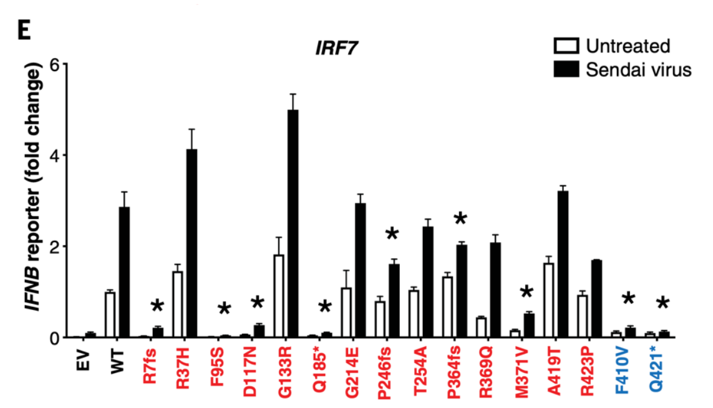

# 7.23 Problem Set 2 Solutions

## Problem 1a-c

While we discussed in class that genetic defects in the complement pathway can cause susceptibility to infection, it turns out that certain defects (in C1q, C2, and C4) can also paradoxically cause susceptibility to the autoimmune disease systemic lupus erythematous (SLE, lupus).

1. Which arm(s) of the complement pathway are involved in this defect? State your reasoning.

> Classical and lectin pathways – C1q is required for classical, and C2 and C4 are required for both classical and lectin. The alternative pathway would be unaffected. OK if your answer discusses other consequences (loss of the C4a anaphylatoxin, for example), but not necessary.

2. One of the driving phenotypes of lupus is immune complex mediated. With this in mind, describe a plausible mechanism for how complement defects in C1q, C2, or C4 affect disease.

> As discussed in class, one of the main functions of complement is to remove and/or C3b-docorated immune complexes via opsonization. Each of these proteins is required for enabling the linkage between presence of the antibody and production of localizaed C3b that's required for phagocytosis/immune clearance.

3. Yourlabmate suggests inhibition of C7 insertion into the plasma memberan as a potential therapeutic strategy. Would this be effective to treat the complement related SLE symptoms? Why or why not?

> No, at least not for the mechanism described above. The mechanism of action/pathology is via the opsonization/phagocytosis pathway, not via formation of a MAC, so C5-C9 function is not required either way.

## Problem 2a-c

Vaccines often require engagement of the innate immune system along with the adaptive immune system. To acheive this, they commonly (but not always) contain adjuvants, or substances that improve the immune response beyond what would be observed from adminstration of a protein antigen alone. These adjuvants work by more broadly engaging the innate immune system to enhance immunity. There are a wide collection of adjuvants currently in use, with many more in development, that engage a diverse array of pattern recognition receptors. For each vaccine, briefly describe what feature or substance is driving innate immune engagement, including what (if any) adjuvant is being used and what is known about what PRRs may be activated.

1. Fluad quadrivalent seasonal influenza vaccine, FDA approved for use in individuals older than 65 in 2020.

> Flaud uses MF59, which is an oil in water emulsion. Its mechanism is not directly linked to a set PRR, but may be linked to cell damage responses and may serve to keep the antigen at the site of the injection, increasing local concentration.

2. Moderna mRNA coronavirus vaccine

> No distinct adjuvant included, but the RNA molecules themselves will activate TLR7/TLR8 signaling.

3. Heplisav-B hepatitis B vaccine

> A CpG adjuvant is added, which activates TLR9

## Problem 3a-d

While mouse experiments enable precise control of genes to determine the link between any given gene and immune function, analgous insights can be gained via natural human genetic variation. Early in the pandemic, a landmark study examined the genetics of a cohort of patients with severe Covid 19 as compared to those with milder disease. They found defects in various aspects of interferon-mediated immunity pathways in 24/659 (3.5%) of the people with life-threatening disease, while only 1/534 (0.2%) of people with milder disease had similar mutations.

1. Explain why defects in the interferon pathway may make an individual more susceptible to a severe viral infection. Be sure to describe at least two possible examples of mechanisms.

> Interferons are some of the body's most important molecules to protect against viral infection. Many mechanisms can be described here, including upregulation of MHC molecules, activate DCs, NK cells, and macrophages, inhibit translation of proteins, supress cell growth, and can destroy dsRNA.

The paper tested particular genetic polymorphisms for their effect on immune function. One subset of patients had mutations in IRF7. A cell line deficient for IRF7 was reconstituted with the wild-type protein or the various mutations. The cell lines were then exposed to Sendai virus (an enveloped RNA virus that serves as a common laboratory tool), and the following was measured:

2. Propose an innate immune sensing pathway that could be affected by mutations such as F95S and D117N.

> TLR signalling

3. Keeping in mind the properties of both SARS-CoV-2 and Sendai viruses, name at least one protein upstream and one protein downstream of IRF7 that are parts of the pathway needed to induce IFNB signaling.

> TLR3, recognizing dsRNA (a part of the viral replication cycle) in endosomes could be upstream. Downstream could included Type I IFN genes. (other pathways can be justified reasonably)

4. A coworker proposes that patients with IRF7 deficiencies could benefit from adminstration of type I interferon during the course of infection. Do you agree? Provide one argument in favor and one argument agaisnt its adminstration.

> Answer in support: IRF7 is affecting the IFN pathway, so providing the downstream result of IRF7 function (type I IFN) could help re-establish the pathway. 

> Answer against: there may be a difference in localized vs systemic IFN injections. Also, there is data showing that immune function itself can cause pathology in patients.

## Problem 4a-b

The paper went on to examine whether there were cell-intrinsic effects to some of the genetic polymorphisms. They examined a fibroblast cell line that was reconstituted with either wild-type or mutated IRF7 or IFNAR1. The cells were then exposed to SARS-CoV-2 either in the presence or abscence of IFNB. They measured the expression of SARS-CoV-2 S protein, which is a measure of viral propogation.

The authors found that cells expressing the mutated form of IRF7 showed worse virus control in the wild-type IRF7 in the abscence of IFNB. In the pressence of exogenous IFNB, the differences were lessened. However, cells expressing IFNAR1 with a frameshift mutation at V225 had higher viral loads both in the absence and prsence of exogenously introduced IFNB.

1. Explain the difference between a cell-intrinsic and cell-extrinsic antiviral response. Provide at least one example of each.

> Cell intrinsic: features that help limit/prevent viral immunity without the need for the rest of the immune system. Inhibiting dsRNA function or protein replication is an example. Cell extrinsic: involves other cells. Upregulating MHCs and activating other immunce cells as examples.

2. Explain the difference observed in behaviour between the IFNAR mutations and IFR7 mtuations.

> IRF7 mutations are preventing the cell's production of IFN - therefore, if it is provided to  the cells, they can still receive IFN signals and institute a cell-intrinsic antiviral response. In IFNAR mutants, the cells can still sense the virus via PRRs and make IFN, but they cannot signal through the produced IFN. Addition of more iFN cannot overcome that phenotype.