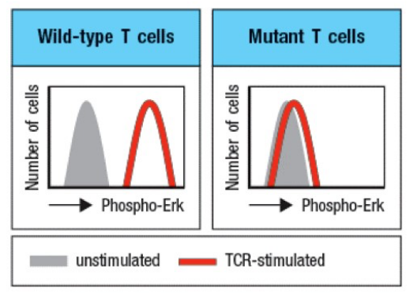

# 7.23 Pset3 Solutions

## 1a-c

After last week's class, you have become interested in how pathogens are recognized by the immune system and decide to pursue this interest in graduate school. You join a lab that has just crossed mice from two-well characterized mouse strains, a female CBA (H-2k haplotype) mouse and a male. C57BL/10(often abbreviated B10, H-2b haplotype) mouse, to produce hybrid F1 pups. In order to begin your work, you must first look up the haplotypes of these strains so that you can determine waht MHC class I proteins they express.

1. What are all of the allelic forms of the MHC proteins that will be expressed in the female, the male, and their F1 offspring?

> Female: h2-Kk, H2-Dk, H2-Ak, H2-Ek

> Male: H2-Kb, H2-Dd, H2-Ab (note - b haplotype do not express E)

> Offspring: H2-Kk, H2-Dk, H2-Ak, H2-Ek, H2-Kb, H2-Db, H2-Ab

2. Your advisor shows you the work of a previous post-doc who identified two viral epitopes (peptides) from the influenza virus that eluted from two HMC class I proteins isolated from cells infected with influenza. Both are derived from the nucleoprotein (NP) of the virus.

| Peptide | Sequence | MHC class I eluted from |
| ------- | -------- | ----------------------- | 
| NP366-374 | ASNENMETM | H2-Db |
| NP147-155 | TYQRYRALV | H2-Kk |

You want to determine if T cell activation by these peptides is in fact restricted to only the MHC class I protein from which they were eluted. To do this, hyou infect 3 mince (CBA, B10 and F1 offspring) with the influenza virus and isolate CD8 T cells from each spleen. You then set up a series of 51Cr release killing assays using raget cells avaialbe in your lab. You find three target cell lines that you can use, and add to the culture either live influenza virus or one of the individual peptides (note: adding peptides to cultures does result in some binding of peptides to MHC I, by some exchange onto some cell surface pMHCI complexes and/or through some form of cross-presentation):

* EL4 cells (H-2b haplotype)

* P815 cells (H-2k haplotype)

* P815t cells (H-2k haplotype transfected with the H-2Db gene)

If the recognition by T cell of peptides really is restricted to the MHC protein from which they were eluted, what do you expect the results of this experiment to be? Please complete the table(where 3 rightmost columns designate Killing by T cells from column value):

| | Target cells | CBA | B10 | F1 |
| ---- | ---- | ---- | ---- | --- | 
| 1 | EL4 + influenza virus |  | x | x |
| 2 | EL4 + NP366-374 |  | x | x |
| 3 | EL4 + NP147-155 |  |   |   |
| 4 | P815 cells |  |  |  |
| 5 | P815 + NP147-155 | x |  | x |
| 6 | P815t + NP147-155 | x |   | x |
| 7 | P815t + influenza virus | x | x | x |

3. A neighboring lab borrows your CBA, B10, and F1 mouse strains to conduct organ transplantation experiments. They transfer pancreas islet cells from B10 or F1 mice to recipients from all three strains. Which translants would you hypothesize would persist, and which would be rejected by the immune system?

> Transplants between individuals of the same strain (B10 &rarr; B10, F1 &rarr; F1) or to F1 progeny (B10 &rarr; F1) would persist. Transplants that cross haplotypes (B10 &rarr; CBA), or are from progeny to parental strains (F1 &rarr; B10 or CBA) would be rejected.

## 2a-c

Connie is a graduate student in a prestigious research centre in the Hundered-Acre Wood, studying the local fauna. Her area of study, of course, is the immune system of the Heffalumps. Her new goal is to characterize the Ig genes of Heffalumps and see if they are similar to and rearrange the same way as the genes of humans and mice.

Connie obtains some HSC's from the bone marrow of a Heffalump, and sequences the genome. Afterwards, by analogy to the known genome sequence of elephants (a closely related species) she identifies and aligns the Heffalump heavy chain locus to that of the elephant. 

She identifies two light chain gene families, which don't look like human or mouse kappa or lambda genes, so she calls them rho and tau. Sequencing reveals the number of gene segments for each of the three gene families.

This is the order of gene segments, with the RSS's, that she finds for the Heffalump heavy chain locus (note: 12 bp spacer RSSs are black(ww); 23 bp spacers are gray(uu)):

Number of gene segments:

| Chain | V | D | J | C |
| ---- | ---- | ---- | ---- | ---- |
| Heavy | 40 | 20 | 80 | 10 |
| Rho LC | 30 | 0 | 60 | 10 | 
| Tau LC | 4 | 0 | 3 | 10 | 

1. Without taking into account junctional diversity, how many unique antibodies sequence combinations can a Heffalump make?

> Note that C regions do not contribute to diversity. Also, each antibody can only have an alpha or a beta light chain (akin to our kappa or lambda chains), so they are added rather than multiplied)

> Heavy Chain Diversity: 40 x 20 x 80 = 64,000

> Alpha Light Chain Diversity: 30 x 60 = 1,800

> Beta Light Chain Diversity: 4 x 3 = 12

> Antibody Diversity: 64,000 x (1800 + 12) = 115,968,000

2. With the help of Piglet and Owl - compensated properly, of course - Connie isolates and sequences cDNAs for the membrane Ig from all the B-cells from several individuals of a strain of Heffalumps. To her surprise, she finds that there is a complete absence of expression of a particular D region of the heavy chain in any functional BCRs/antibodies. She hypothesizes that there is something wrong with this defective D segment (Dd), so she isolates and sequences the genomic DNA continaing this diagram, you may assume many other V, D, and J regions exist but only a single D region has the unique structure of Dd). Explain why this D region is not expressed in B-cell membrane immunoglobulins.

[ V ] ww >  - - - < uu [ D ] uu > - - - < ww [ Dd ] uu > - - - - < ww [ J ]

> The Dd region has mismatched RSS sequences - since the V and J regions are 12 bp spacer RSSs, the D region must be 23bp RSS to work. Since Dd does not, it will not be included in a recombined receptor.

3. You decide to extend this work by studying the local Heffalump population in Kendell Squaare. You observe that a subset of antibody sequences in mature B cells seem to have a CDR3 loop that skew significantly longer than those found in either mice or Heffalumps from the hundred acre wood. This length skew occurs independently of what V region is used. You sequence the same Ig locus as Connie, but notice this alteration:

[ V ] ww >  - - - < uu [ D ] uu > - - - < ww [ Dd ] ww > - - - - < ww [ J ]

The right spacer on Dd goes from being black ww 12 bp spacer to grey uu 23 bp spacer. 

Provide a hypothesis for how Kendall Heffalumps create some antibodies with longer CDR3 loops. Explain why all V regions may demonstrate longer than normal CDR3 loops. Explain why this cahnge is seen in some, but not all, of antibody sequences. 

> Since the Kendall heffalumps have a Dd gene segment that can recombine with a J and another D, you end up with V-D-(Dd)-J recombination - adding some more genetic material that can extend the sequence. Since this is in the VDJ junction, this adds length to the CDR3 loop. Dd could in theory be recombined with any V region, so there is no V region bias. It is also tottally possible for Dd to not be included (V-D-J can occur as normal) - if this is the case, those antibodies will not have biased sequences. 

## 3a-d

You discover that a subset of the Heffalumps demonstrate defective TCR signaling. After conducting a bevy of tests, you find what you beleive to be a sign of the possible mechanism of disfunction. You stimulate T cells via CD3/CD28 crosslinking, fix and permeabilize the cells to allow for staining of cytosol, and then measure them with an antibody that is specific for the phosphorylated version of Erk. You observe the following: 

1. Describe in 1 sentence the results above.

> Mutant T cells lose the ability to phosphorylate Erk upon a signal transmitted to the TCR. 

2. Interestingly, you discover that the same CD3/CD28 crosslinking still leads to robust calcium flux through Oria1 (the CRAC channel). Based upon this results, propose a transcription factor that should still be functional in T cell activiation. Explain your reasoning.

> NFAT signaling is directly downstream of calcium. If there is still calcium flux, you'd still expect NFAT to be functional.

3. Integrating the results above, propose two distinct proteins that may be mutated in the Heffalumps.

> The protein would be upstream of Erk but not so far upstream that CRAC is impaired. Multiple options here possible, including Raf/Mek.

4. Would you expect to observe a corresponding defect in B cell signaling? Why or why not?

> Answer depeds on answer to part C, but likely yes, due to many of the same proteins being used for B and T cell signaling.

## 4.1-6

Please order the following 6 statements about antigen presentation in order they occur and fill in the blanks. Please be aware one statement is not part of the molecular process and should be labeled with an X, but the blanks should still be filled in

5. Cell Surface MHCI () complexes stimulate () T cells in the lymph node; Peptide, CD8

1. A mutation in the coding sequence of a protein results in misfolding which results in () and degradation by the (); ubiquitination, proeasome

2. Small () long peptide sequences from the cytoplasm are being imported to the () by Tap1/2 (); 8-15aa, ER, complexes

X. Following MHCII formation the () stabilizes the molecules and gets cleaved into () by cathespin S; invariant chain, LIP10 Li and CLIP

3. MHCI alpha proteins fold in the endoplasmic reticulum in the presence of () while () associated with the complex at a later stage; calnectin, B2M

4. () ensures proper loading of MHCI molecules; ERp57 and or tapasin